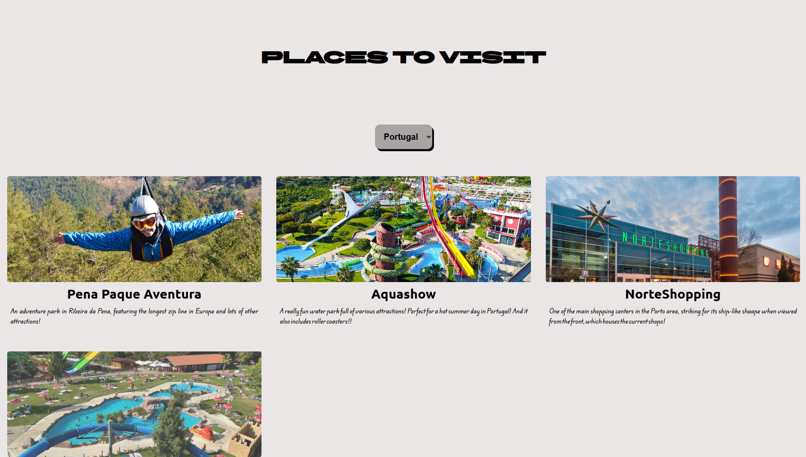

# Places To Visit
On **Places Ti Visit** you can fins some places to visit in countries like Portugal, USA, Brazil (and possibly more soon!)

You can try it [Here](https://brundevcoder.github.io/places-to-visit/)

## How to use
It was designed to be very simple! Just click where the name of a country is already written (by default it's the USA), and then click on the available country you want to visit to discover other places to go!

## How tu run it?
That's pretty simple too! Just clone this repository, and then open `index.html` to start viewing! Or you can also use the Live Server extension from Vs Code!